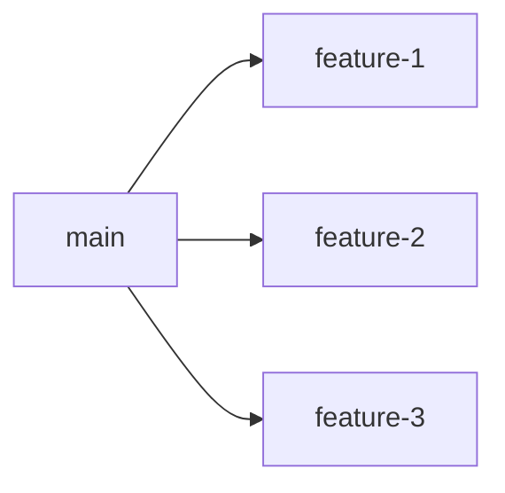
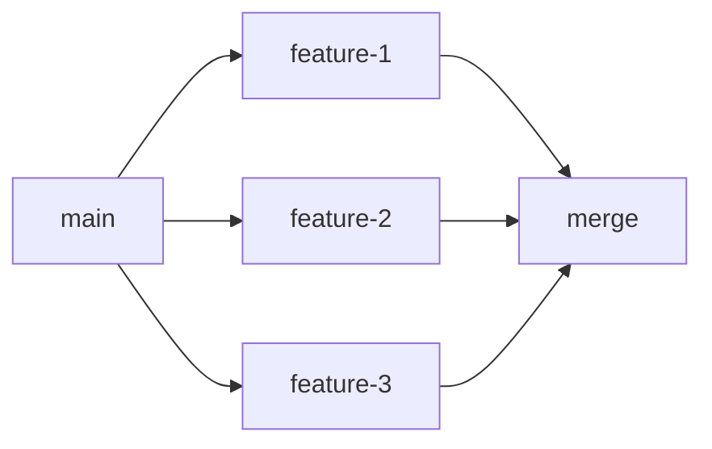
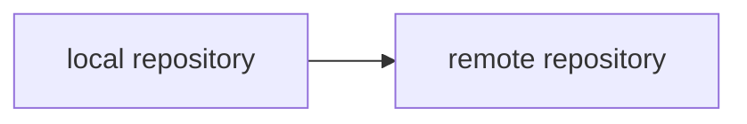
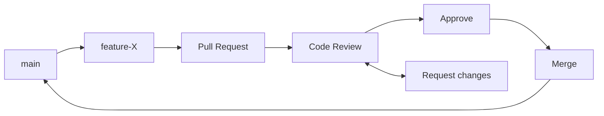
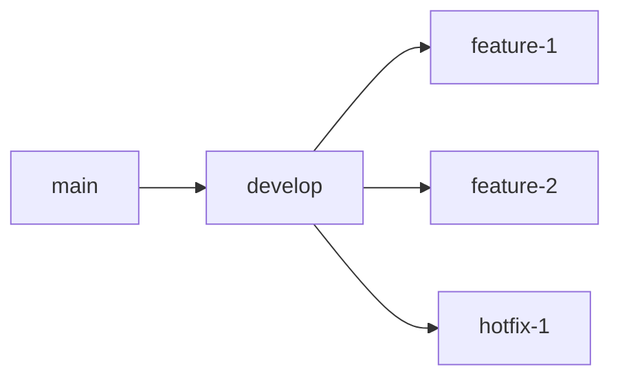
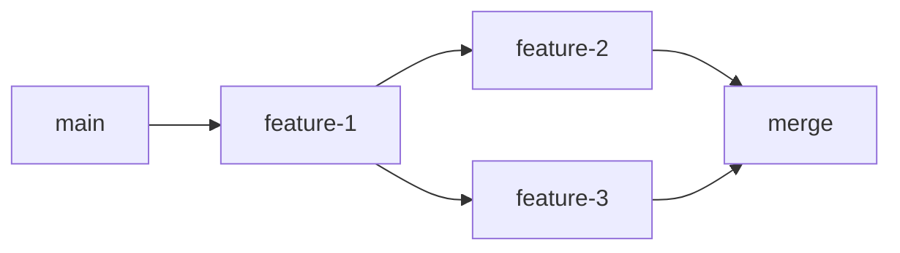

# Workshop de Git

No mundo atual, o desenvolvimento de software é um esforço colaborativo. Desenvolvedores trabalham juntos para construir software e precisam de ferramentas que os ajudem a gerenciar seu código, rastrear mudanças e colaborar de forma eficaz. O Git é um sistema de controle de versão que auxilia os desenvolvedores a realizar todas essas tarefas. Neste workshop, exploraremos o Git, GitHub e GitFlow, focando em como essas ferramentas são essenciais para controle de versão, colaboração e gestão de fluxo de trabalho em ambientes de desenvolvimento modernos.

## 1. Uma breve história

### 1.1. Como gerenciávamos o código antes dos sistemas de controle de versão maduros

#### 1.1.1. Copiar e colar

Antes dos sistemas de controle de versão, os desenvolvedores costumavam copiar e colar o código de um arquivo para outro. Isso era propenso a erros e tornava difícil rastrear as mudanças feitas ao longo do tempo. Outra medida adotada às vezes era criar versões do código, por exemplo: `meu_codigo_v1.py`, `meu_codigo_v2.py`, `meu_codigo_v3.py`, etc. Quando um desenvolvedor finalizava uma alteração, por exemplo, ele criava um `.tar.gz` ou `.zip` do código e enviava para o cliente, equipe ou para o servidor de produção.

**Problemas:**

- Difícil rastrear mudanças.
- Propenso a erros.
- Difícil colaborar com outros desenvolvedores.

#### 1.1.2. Sistemas SCM (Gestão de Código Fonte) e CVS (Sistema de Versão Concorrente)

Parte do amplo sistema de controle de configuração de software, ele operava através da centralização de um repositório de código fonte. O repositório era acessado por desenvolvedores que podiam fazer check-in e check-out de arquivos. O sistema mantinha um histórico de versões e permitia que os desenvolvedores colaborassem em projetos de software. Alguns exemplos de sistemas SCM são: Apache Subversion, Perforce e ClearCase.

**Pontos positivos:**

- Histórico de versões.
- Colaboração entre desenvolvedores.
- Controle de acesso.

**Problemas:**

- Centralização do repositório.
- Dificuldade em colaborar com outros desenvolvedores.
- Dificuldade em gerenciar múltiplas versões de um projeto (branching e merging).

#### 1.1.3. Para os curiosos

- [Fabio Akita - Entendendo GIT | (não é um tutorial!)](https://www.youtube.com/watch?v=6Czd1Yetaac)
- [Fabio Akita - Usando Git Direito | Limpando seus Commits!](https://www.youtube.com/watch?v=6OokP-NE49k)
- [A Git Origin Story](https://www.linuxjournal.com/content/git-origin-story)
- [Git - Linus Torvalds](https://www.youtube.com/watch?v=8dhZ9BXQgc4)

### 1.2. Por que Linus Torvalds criou o Git

No início, o Kernel do Linux foi gerenciado através da colaboração de versões manuais via `.tar.gz`, porém eventualmente Linus migrou para um sistema CVS chamado BitKeeper. Em 2005, a relação entre a comunidade do Linux e a empresa que desenvolvia o BitKeeper azedou, e a ferramenta foi retirada. Isso levou Linus a criar o Git, um sistema de controle de versão distribuído que resolveu muitos dos problemas que ele enfrentou com o BitKeeper.
Para ele, não havia uma forma de criar um CVS da forma correta. Então descreveu os seguintes pilares:

- Confiável
- Alta performance
- Distribuído
- Gestão de conteúdo

Então, ele criou o Git para resolver esses problemas (em 2 semanas).

## 2. Bê-a-ba do git

### 2.1. Conceitos e terminologia

#### 2.1.1. Repositório

Um repositório é um diretório que contém todos os arquivos e histórico de um projeto. Ele é a base de um projeto Git e é onde todas as alterações são armazenadas.

```bash
git init
```

#### 2.1.2. Commit

Um commit é uma alteração em um repositório Git. Ele contém um conjunto de mudanças em arquivos e diretórios, juntamente com uma mensagem que descreve o que foi alterado.

```bash
git commit -m "<mensagem>"
```

#### 2.1.3. Branch

Um branch é uma linha de desenvolvimento em um repositório Git. Ele permite que os desenvolvedores trabalhem em diferentes versões de um projeto ao mesmo tempo, sem interferir no trabalho de outras pessoas.

A branch principal de um repositório Git é chamada de `master` ou `main`. Os desenvolvedores criam novas branches a partir da branch principal para trabalhar em novas funcionalidades ou correções de bugs.



```bash
git branch <nome-da-branch>
```

#### 2.1.4. Merge

Um merge é a combinação de duas ou mais branches em um repositório Git. Ele permite que os desenvolvedores combinem o trabalho de diferentes branches em uma única linha de desenvolvimento.



```bash
git merge <nome-da-branch>
```

Esse comando irá mesclar a branch especificada na branch atual.

#### 2.1.5. Stash

O stash é um recurso do Git que permite que os desenvolvedores salvem temporariamente as alterações em seu diretório de trabalho sem fazer um commit. Isso é útil quando você deseja alternar entre branches ou reverter as alterações feitas em um arquivo.

```bash
git stash
```

Isso irá salvar as alterações em um stash temporário, permitindo que você as recupere posteriormente.

```bash
git stash pop
```

#### 2.1.6. Tag

Uma tag é uma referência a um commit específico em um repositório Git. Ela é usada para marcar versões de um projeto e facilitar a navegação no histórico do repositório.

```bash
git tag <nome-da-tag>
```

#### 2.1.7. Revert

O revert é um comando do Git que desfaz um commit específico em um repositório Git. Ele cria um novo commit que desfaz as alterações feitas no commit original.

```bash
git revert <hash-do-commit>
```

#### 2.1.8 Cherry-pick

O cherry-pick é um comando do Git que permite que os desenvolvedores apliquem um commit específico de uma branch para outra. Isso é útil quando você deseja adicionar uma alteração específica de uma branch para outra sem mesclar todas as alterações.

```bash
git cherry-pick <hash-do-commit>
```

#### 2.1.9. Update Index

O update index é um comando do Git que atualiza o índice de um repositório Git com as alterações feitas nos arquivos. Isso é útil quando você deseja preparar arquivos para um commit sem fazer alterações adicionais.

```bash
git update-index --<opção> <arquivo>
```

#### 2.1.10. Push

O push é um comando do Git que envia as alterações feitas em um repositório local para um repositório remoto. Isso é útil quando você deseja compartilhar seu trabalho com outras pessoas ou colaborar em um projeto.



```bash
git push
```

#### 2.1.11. Pull

O pull é um comando do Git que obtém as alterações feitas em um repositório remoto e as mescla com o repositório local. Isso é útil quando você deseja atualizar seu repositório local com as alterações feitas por outras pessoas.


```bash
git pull
```

#### 2.1.12. Status

O status é um comando do Git que exibe o estado atual do repositório, incluindo arquivos modificados, arquivos adicionados e arquivos removidos. Isso é útil para verificar o que foi alterado desde o último commit.

```bash
git status
```

#### 2.1.13. Log

O log é um comando do Git que exibe o histórico de commits de um repositório, incluindo informações como autor, data e mensagem de commit. Isso é útil para visualizar o histórico do projeto e entender as alterações feitas ao longo do tempo.

```bash
git log
```

#### 2.1.14. Checkout

O checkout é um comando do Git que permite que os desenvolvedores alternem entre branches em um repositório Git. Isso é útil quando você deseja trabalhar em diferentes versões de um projeto ao mesmo tempo.

```bash
git checkout <nome-da-branch>
```

#### 2.1.15 .gitignore

O `.gitignore` é um arquivo que contém uma lista de arquivos e diretórios que o Git deve ignorar ao rastrear as alterações em um repositório. Isso é útil para evitar que arquivos temporários, arquivos de compilação e outros arquivos desnecessários sejam incluídos no repositório.

```bash
echo "<arquivo-ou-diretório>" >> .gitignore
```

### 3. Criando meu primeiro repositório

#### 2.2.1. Inicializando um repositório

Para criar um repositório Git, você precisa inicializá-lo em um diretório existente ou criar um novo diretório para ele. Para inicializar um repositório, você pode usar o comando:

```bash
git init
```

Este comando cria um diretório `.git` no diretório atual, que contém todos os dados necessários para o funcionamento do Git, como histórico do repositório.
Ele é normalmente oculto nas listagens de diretórios, IDEs e exploradores de arquivos.

Precisamos também de algo para versionar, então vamos criar um arquivo `README.md` como exemplo:

```markdown
# Meu Projeto

Este é meu primeiro projeto Git.
```

#### 2.2.2. Adicionando arquivos ao repositório

Depois de inicializar um repositório, você pode adicionar arquivos e diretórios a ele e criar alterações para commit. Para adicionar arquivos ao repositório, você pode usar o comando:

```bash
git add README.md
```

Este comando adiciona o arquivo `README.md` ao índice do repositório, que é uma área temporária onde as alterações são preparadas para commit.

#### 2.2.3. Criando um commit

Depois de adicionar arquivos ao índice, você pode criar um commit com as alterações. Para criar um commit, você pode usar o comando:

```bash
git commit -m "Adicionando arquivo README.md"
```

Caso queira detalhar mais o que foi feito, você pode omitir o `-m` e o Git abrirá um editor de texto para você escrever a mensagem de commit. Porém, é recomendado que você use o `-m` para mensagens curtas e objetivas, usualmente iremos utilizar o GitHub ou outro serviço de hospedagem de código para gerenciar grandes alterações através de Merge Requests ou Pull Requests.

#### 2.2.4. Visualizando o histórico do repositório

Depois de criar um commit, você pode visualizar o histórico do repositório para ver as alterações feitas ao longo do tempo. Para visualizar o histórico do repositório, você pode usar o comando:

```bash
git log
```

Este comando exibe uma lista de commits no repositório, incluindo informações como autor, data e mensagem de commit.

Agora, a cada alteração que você fizer no arquivo `README.md` ou em qualquer outro arquivo do repositório, você pode adicionar e commitar essas alterações para rastreá-las ao longo do tempo. Isso é útil para manter um registro de todas as alterações feitas no projeto e colaborar com outras pessoas. Porém tudo isso está sendo feito localmente, para compartilhar seu trabalho com outras pessoas ou colaborar em um projeto, você precisa de um repositório remoto.

## 4. GitHub 🐙

### 4.1. Criando uma conta no GitHub

Para hospedar seu código no GitHub, você precisa criar uma conta no site. Para criar uma conta no GitHub, você pode seguir os seguintes passos:

1. Acesse o site do GitHub em [https://github.com](https://github.com).
2. Crie sua conta, você consegue sozinho 😉.

### 4.2. Subindo código para o GitHub

Agora com a conta criada, podemos subir nosso repositório local para o GitHub. Para fazer isso, você precisa criar um repositório no GitHub e adicionar um repositório remoto ao seu repositório local.

#### 4.2.1. Criando um repositório no GitHub

Para criar um repositório no GitHub, você pode seguir os seguintes passos:

1. Na página inicial do GitHub, clique no botão `New` no canto superior direito.
2. Preencha o nome do repositório, a descrição e outras configurações.
3. Clique no botão `Create repository`.
4. Pronto, seu repositório foi criado.

Agora você precisa adicionar um repositório remoto ao seu repositório local para sincronizar as alterações entre os dois. Para adicionar um repositório remoto, você pode usar o comando:

```bash
git remote add origin <url-do-repositorio>
```

Este comando adiciona um repositório remoto chamado `origin` ao seu repositório local, que aponta para o repositório no GitHub. Agora você pode enviar as alterações do seu repositório local para o repositório remoto no GitHub usando o comando `git push`.

#### 4.2.2. Enviando código para o GitHub

Para enviar as alterações do seu repositório local para o repositório remoto no GitHub, você pode usar o comando:

```bash
git push -u origin main
```

Agora o código do seu repositório local e remoto estão sincronizados. Você pode continuar a fazer alterações no seu repositório local e enviá-las para o repositório remoto no GitHub sempre que quiser através do comando `git push`.

### 4.3. Criando um Pull Request

Podemos utilizar o poder de branches do Git para auxiliar no desenvolvimento paralelo de funcionalidades, correções de bugs e outras alterações no projeto. Para isso, podemos criar branches a partir da branch principal do repositório e fazer alterações nesses branches sem interferir no trabalho de outras pessoas.

Ao final do processo de desenvolvimento, podemos sincronizar as alterações em uma única branch através do merge pelo GitHub onde o processo é chamado de Pull Request. 

O Pull Request permite fazer o acompanhamento das alterações feitas, revisão de código, discussão sobre as alterações e a integração das alterações no repositório principal.

Para abrir um Pull Request no GitHub, você pode seguir os seguintes passos:

1. Clique na aba `Pull requests`.
2. Clique no botão `New pull request`.
3. Selecione a branch que contém as alterações que você deseja integrar.
5. Preencha o título e a descrição do Pull Request.
6. Clique no botão `Create pull request`.

Agora você pode revisar as alterações feitas, discutir sobre as alterações e integrar as alterações no repositório principal através do Pull Request.

## 5. Trabalhando com Git & GitHub

Como já foi discutido, o Git nasceu para resolver problemas de colaboração e versionamento de código. Empresas hoje em dia em sua maioria, utilizam Git e GitHub para gerenciar seus projetos de software. Para isso, é importante entender como trabalhar com Git e GitHub em um ambiente de equipe.

### 5.1. Resolvendo conflitos

Conflitos são comuns em ambientes de equipe, onde vários desenvolvedores estão trabalhando no mesmo projeto ao mesmo tempo. Para resolver conflitos, você pode usar o comando `git merge` ou `git rebase` para combinar as alterações de diferentes branches.

#### 5.1.1. Resolvendo conflitos com `git merge`

Quando você deseja apenas mesclar as alterações de uma branch em outra, você pode usar o comando `git merge`. No entanto, se houver conflitos entre as alterações, você precisará resolvê-los manualmente.

Para resolver conflitos com `git merge`, você pode seguir os seguintes passos:

1. Faça um `git pull` para obter as alterações mais recentes do repositório remoto.
2. Faça um `git merge` para combinar as alterações da branch remota com a sua branch local.
3. Resolva os conflitos manualmente, editando os arquivos com conflitos.
4. Faça um `git add` para adicionar os arquivos com conflitos resolvidos ao índice.
5. Faça um `git commit` para criar um novo commit com os conflitos resolvidos.
6. Faça um `git push` para enviar as alterações para o repositório remoto.

#### 5.1.2. Resolvendo conflitos com `git rebase`

Caso a branch em que você está trabalhando esteja muito desatualizada em relação à branch principal, você pode usar o comando `git rebase` para atualizar a sua branch com as alterações mais recentes da branch principal.

### 5.2. Usando Pull Requests

Como já foi discutido, o Pull Request é uma ferramenta poderosa para colaboração em projetos de software. Usualmente mais de uma pessoa trabalha em uma Pull Request, onde ela indica alguém para revisar as alterações feitas e aprovar a integração das alterações no repositório principal.



### 5.3. GitFlow

GitFlow é um modelo de branching para gerenciar features e releases em um projeto de software. Ele define um conjunto de regras e convenções para criar e mesclar branches, o que facilita a colaboração e o gerenciamento de versões em um projeto.

Usualmente, um projeto GitFlow possui as seguintes branches:

- `main` ou `master`: branch principal do projeto, onde o código estável é mantido.
- `develop`: branch de desenvolvimento, onde as alterações são integradas antes de serem mescladas na branch principal.
- `feature-X`: branches de features, onde as novas funcionalidades são desenvolvidas.
- `hotfix-X`: branches de hotfixes, onde correções de bugs críticos são feitas.

Embora você também possa encontrar branches relacionadas a diferentes ambientes como `staging` e `user-testing`. Essas branches são usadas para testar as alterações antes de serem integradas na branch principal isolando o código em ambientes de teste.



### 5.4. Automatizando tarefas com GitHub Actions

GitHub Actions é uma ferramenta de automação de CI/CD integrada ao GitHub. Ela permite que você crie workflows personalizados para automatizar tarefas como testes, build e deploy de software.

Você pode criar workflows no GitHub Actions usando arquivos de configuração YAML que definem as etapas a serem executadas, os eventos que acionam as etapas e as condições sob as quais as etapas são executadas.

Caso queira saber mais sobre GitHub Actions, você pode acessar a documentação oficial em [https://docs.github.com/pt/actions](https://docs.github.com/pt/actions).

### 5.5 Utilizando o fluxo completo

Agora vamos criar uma Action no GitHub que irá validar o `README.md` para garantir que ele não esteja vazio. Para tal, vamos começar criando uma Issue no repositório.

Podemos nomear ela de `Adicionar validação do README.md` e descrever o que queremos fazer. Após isso, podemos criar um Pull Request que irá resolver essa Issue.

A partir dessa Issue, podemos também gerar a branch que irá ser utilizada para resolver o problema. Vamos nomear ela de `feature/validate-readme`.

Com ela criada, vamos voltar no nosso repositorio local e atualizar o projeto com o comando `git pull` para garantir que estamos com as alterações mais recentes do repositório.

Agora vamos fazer o checkout para a branch `feature/validate-readme` com o comando `git checkout -b feature/validate-readme`.

Com a branch criada, vamos criar um arquivo `.github/workflows/validate-readme.yml` com o seguinte conteúdo:

```yaml
name: Check README file

on:
  push:
    branches:
      - main
  pull_request:
    branches:
      - main

jobs:
  check-readme:
    runs-on: ubuntu-latest

    steps:
      - name: Checkout code
        uses: actions/checkout@v3

      - name: Check if README.md exists and is not empty
        run: |
          if [ ! -f "README.md" ]; then
            echo "README.md does not exist!"
            exit 1
          fi

          if [ ! -s "README.md" ]; then
            echo "README.md is empty!"
            exit 1
          fi

      - name: Success message
        run: echo "README.md exists and is not empty!"
```

Para quem já conhece um pouco de Linux, talvez consiga entender o que está acontecendo nesta action, mas para quem não conhece, vamos passo a passo.

* 1. `name`: Nome da Action.
* 2. `on`: Eventos que irão acionar a Action.
  * 2.1. `push`: Quando um push é feito na branch `main`.
  * 2.2. `pull_request`: Quando um Pull Request é aberto na branch `main`.
* 3. `jobs`: Conjunto de tarefas a serem executadas.
  * 3.1. `check-readme`: Nome do job.
    * 3.1.1. `runs-on`: Sistema operacional onde a Action será executada.
    * 3.1.2. `steps`: Passos a serem execut
      * 3.1.2.1. `name`: Nome do passo.
      * 3.1.2.1. `run`: Comando que será executado.

Os comandos executados basicamente verificam através do `bash` se o arquivo `README.md` existe e se ele não está vazio. Caso ele não exista ou esteja vazio, a Action irá falhar ao ser executada devido ao `exit 1` (aprendam Linux crianças).

Com o arquivo criado, vamos adicionar ele ao repositório com os comandos:

```bash
git add .github/workflows/validate-readme.yml

git commit -m "Adicionando validação do README.md"

git push origin feature/validate-readme
```

Com o arquivo adicionado, vamos criar um Pull Request no GitHub para resolver a Issue que criamos anteriormente. Após a criação do Pull Request, a Action irá ser executada e validar se o `README.md` existe e não está vazio.

Mas legal né. Agora quero que resolvam a Issue e façam o Pull Request para validar o `README.md` e garantir que ele não está vazio. 😁 (10 minutos)

Eu irei revisar e aprovar o Pull Request de vocês.

## 6. Montando um perfil

Como desenvolvedores, usualmente criamos muitos projetos de software sejam eles pessoais, de estudo ou profissionais. E para compartilhar esses projetos com outras pessoas, utilizamos o GitHub.
Isso importa principalmente para aqueles que estão entrando no mercado de trabalho, pois é uma forma de mostrar o que você sabe fazer. Afinal um recrutador ou alguém que esteja fazendo uma triagem inicial, irá olhar seu perfil no GitHub para ver o que você sabe fazer.

E não importa o código que você coloca lá, e sim que você coloca código lá. Então, não tenha medo de colocar seus projetos lá, mesmo que você ache que eles não estão bons o suficiente.

Eu por exemplo tenho código em PHP 7 lá de 2019 (e tem coisa ainda mais velha) nesse repositório por exemplo [https://github.com/MateuxLucax/almocai](https://github.com/MateuxLucax/almocai). Alguém já olhou? Não. Mas está lá, e isso é o que importa. Mostra que estou sempre aprendendo e evoluindo. Mostra que já em algum momento trabalhei com PHP.

Por isso fica a dica de sempre colocar seus projetos no GitHub, mesmo que você ache que eles não estão bons o suficiente ou que ainda não estão finalizados. Isso é uma armadilha pois nós programadores raramente terminamos os projetos que começamos.

Então, vamos lá. Vamos montar um perfil bonitinho no GitHub.

### 6.1. Analisando perfis mundo afora

* [Fabio Akita](https://github.com/akitaonrails)
* [Linus Torvalds](https://github.com/torvalds)

Como podemos ver, não tem nada de bonitinho no perfil deles. Mas não precisam mesmo! Já são pessoas consolidadads no mundo da tecnologia.

Porém, nós não somos eles, então vamos deixar nosso perfil bonitinho.

### 6.2. Customizando o perfil

Para isso, podemos utilizar uma funcionalidade do GitHub que permite customizar a página inicial do nosso perfil. Para isso, vamos criar um repositório com o mesmo nome do nosso usuário.

Após criado, podemos usar como base o repositório [https://github.com/abhisheknaiidu/awesome-github-profile-readme](https://github.com/abhisheknaiidu/awesome-github-profile-readme?tab=readme-ov-file). Nele temos vários exemplos de perfis customizados para inspirar.

Agora cada um pode customizar o perfil do GitHub de vocês e deixar ele bonitinho. 😁 (10 - 15 minutos).

Com ele customizado, vamos criar uma Issue no repositório do workshop com o link do perfil de vocês para que todo mundo possa ver.

## 7. Melhores práticas e bônus

### 7.1. Melhores práticas para usar o Git

Tente sempre manter seu repositório limpo e organizado. Isso inclui:

- Escrever mensagens de commit claras e concisas. Podemos utilizar o padrão [Conventional Commits](https://www.conventionalcommits.org/pt-br/v1.0.0/) para isso.
- Sempre utilizar branches para desenvolver novas funcionalidades e correções de bugs.
- Fazer commits frequentes e pequenos para manter um histórico de alterações detalhado. Isso facilita a revisão de código e a resolução de conflitos.
- Utilizar tags para marcar versões do projeto e facilitar a navegação no histórico do repositório. Auxilia também na criação de releases.
- Utilizar o `.gitignore` para ignorar arquivos e diretórios desnecessários no repositório. Isso evita que arquivos temporários, arquivos de compilação e outros arquivos desnecessários sejam incluídos no repositório. Por exemplo o querido `node_modules` de projetos JavaScript ou então o `target` para nós Javeiros.
- Utilizar o GitFlow para gerenciar features e releases em um projeto de software. Isso facilita a colaboração e o gerenciamento de versões em um projeto.

### 7.2. Árvore de commits

A árvore de commits é uma representação visual do histórico de commits de um repositório Git. Ela mostra como as branches se ramificam e se mesclam ao longo do tempo, permitindo que você visualize o fluxo de trabalho e as relações entre os commits.



Para visualizar a árvore de commits de um repositório Git, você pode usar o comando `git log --graph`.
Ou então no GitHub, você pode visualizar o histórico de commits de um repositório em uma interface gráfica. Para isso clique no menu `Insights` e depois em `Network`.

### 7.3. GitLens

GitLens é uma extensão para o Visual Studio Code que fornece recursos avançados de controle de versão para o Git. Ele permite que você visualize o histórico de commits, compare alterações, navegue entre branches e muito mais diretamente no editor de código.

### 7.4 GitHub Desktop

Para aqueles que ainda tem medo de usar o terminal, o GitHub Desktop é uma ótima opção. Ele é uma interface gráfica para o Git que facilita o controle de versão e a colaboração em projetos de software. Ele permite que você visualize o histórico de commits, crie branches, faça commits e muito mais de forma intuitiva.

### 7.5. GitHub Pages

O GitHub Pages é um serviço do GitHub que permite hospedar sites estáticos gratuitamente. Você pode usar o GitHub Pages para criar um site pessoal, um blog, uma documentação ou qualquer outro tipo de site estático.
É uma opção para quem deseja já criar um portfólio ou um blog para compartilhar conhecimento. Quem sabe um post de blog sobre o que você aprendeu nesse workshop? Sério, é algo levado muito a sério por recrutadores.

Para saber mais sobre o GitHub Pages, você pode acessar a documentação oficial em [https://docs.github.com/pt/pages](https://docs.github.com/pt/pages). É bem simples de usar e você pode criar um site em poucos minutos.

### 7.6. GitHub CLI

Criado para facilitar a interação com o GitHub através da linha de comando, o GitHub CLI permite que você crie repositórios, abra Pull Requests, faça revisões de código e muito mais diretamente do terminal. É uma alternativa mais rápida e prática para aqueles que já estão acostumados com a linha de comando porém gostariam de ter algumas facilidades do GitHub Desktop.

### 7.7. GitHub Student Developer Pack

Essa é talvez a única coisa que você precisa saber hoje. O GitHub Student Developer Pack é um pacote de ferramentas e recursos gratuitos para estudantes que desejam aprender e desenvolver software. Ele inclui acesso gratuito a ferramentas como o GitHub Pro, o GitHub Pages, o Visual Studio Code, o JetBrains IDEs e muito mais.

Para conseguir o seu acesso, pode utilizar o email da sua instituição de ensino ou então o seu email de estudante. Para saber mais sobre o GitHub Student Developer Pack, você pode acessar o site oficial em [https://education.github.com/pack](https://education.github.com/pack).

### 7.8. Explore o GitHub

O GitHub é uma plataforma incrível com diversas funcionalidades que vão te ajudar no desenvolvimento.

## 8. Conclusão

O Git é uma ferramenta poderosa para controle de versão e colaboração em projetos de software. Ele permite que você rastreie mudanças, trabalhe em diferentes versões de um projeto ao mesmo tempo e colabore com outras pessoas de forma eficaz. O GitHub é uma plataforma que complementa o Git, fornecendo recursos adicionais para gerenciar projetos de software, colaborar com outras pessoas e automatizar tarefas.

Neste workshop, exploramos o Git, GitHub e GitFlow, focando em como essas ferramentas são essenciais para controle de versão, colaboração e gestão de fluxo de trabalho em ambientes de desenvolvimento modernos. Espero que você tenha aprendido algo novo e que possa aplicar esses conhecimentos em seus projetos futuros.

Se tiver alguma dúvida ou sugestão, fique à vontade para compartilhar. Estou sempre disponível para ajudar e trocar conhecimentos. Obrigado por participar e até a próxima! 🚀

## 9. Referências

- [Git - Documentação Oficial](https://git-scm.com/doc)
- [GitHub - Documentação Oficial](https://docs.github.com/pt)
- [A successful Git branching model](https://nvie.com/posts/a-successful-git-branching-model/)
- [GitHub Pages - Documentação Oficial](https://docs.github.com/pt/pages)
- [Fabio Akita](https://www.youtube.com/@Akitando)
- [Uma Breve História do Git](https://git-scm.com/book/pt-br/v2/Começando-Uma-Breve-História-do-Git)
