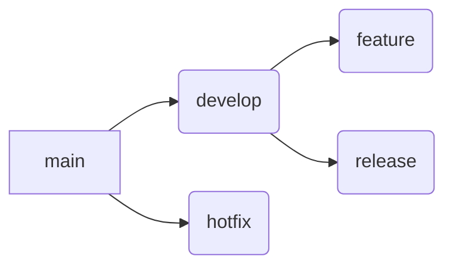

# Git Workshop

## Introduction

In this workshop, we will explore Git, GitHub, and GitFlow, focusing on how these tools are essential for version control, collaboration, and workflow management in modern development environments. By the end of this workshop, you will:

-	Understand why Git is important for version control.
-	Learn basic Git commands and concepts.
-	Learn how to host code on GitHub.
-	Understand GitFlow, a branching model for managing features and releases.

### Roadmap

1. [Why Git?](#1-why-git)
2. [Git Basics](#2-git-basics)
3. [PoorGit](#3-poorgit)
4. [GitHub](#4-github)
5. [GitFlow](#5-gitflow)
6. [References](#6-references)

## 1. Why Git?

### Objective:

- Introduce the concept of version control.
- Explain the problems Git solves.

### Discussion Points:

- What is Version Control?:
- A system to track changes in files and manage the history of a project.
- Why manual backups or Dropbox-like file saving isn’t enough.
- Problems Solved by Git:
- Collaboration: Multiple developers can work on the same project without conflicts.
- Change tracking: Easily review changes, revert to previous versions, or understand the evolution of a project.
- Branching: Separate work into feature branches, experimental code, or releases.
- Distributed: No central dependency for project history (unlike centralized systems like SVN).
- Why Use Git Over Other Version Control Systems?
- Speed: Git operations (commits, branching, etc.) are local and fast.
- Security: Every commit is stored in a hashed object format, ensuring integrity.
- Flexibility: Git supports multiple workflows, including centralized, feature-branching, and GitFlow.

## 2. Git Basics

### Objective:

- Get hands-on with basic Git commands and concepts.

### Core Concepts:

- Repository: A storage for all the files and commit history of your project.
- Local Repository: Exists on your local machine.
- Remote Repository: Hosted on platforms like GitHub or GitLab.
- Commit: A snapshot of your project at a specific point in time.
- Staging Area: An intermediate space where changes are prepared for a commit.

### Essential Commands:

- git init: Initialize a new repository.
- git status: Check the current status of the working directory.
- git add: Stage files for commit.
- git commit: Save changes to the local repository.
- git log: View the history of commits.
- git diff: Show differences between your working directory, the staging area, and commits.

### Hands-on:

1.	Initialize a repository with git init.
2.	Add and commit files using git add and git commit.
3.	View history with git log.
4.	Make changes to a file, view differences using git diff.

## 3. PoorGit

### Objective:

- Build a custom Git-like system from scratch using Node.js.

### Topics Covered:

- File Tracking: How to track changes in files over time.
- Staging: Concept of preparing files for commit.
- Snapshots/Commits: Saving the state of the project.

### Hands-on:

- Build a basic version control system (like PoorGit) using Node.js (from our previous conversation).
- Implement the following commands:
- init: Initialize a .simple_git directory.
- add: Track file changes.
- commit: Save snapshots.
- diff: Show differences between snapshots.

### Learning Goals:

- Understand the core mechanics of Git.
- Appreciate how Git stores data and handles diffs.

## 4. GitHub

### Objective:

- Learn how to host repositories on GitHub and collaborate with others.

### Core Concepts:

- Remote Repository: A repository hosted on a remote server like GitHub.
- Pushing and Pulling: Sending and receiving data between local and remote repositories.
- Forking: Copying someone else’s repository to make your own contributions.
- Pull Request (PR): Propose changes to the main repository.

### Commands:

- git clone: Clone a repository from GitHub to your local machine.
- git remote add origin: Link a local repository to a remote one (e.g., GitHub).
- git push: Send local changes to the remote repository.
- git pull: Fetch and merge changes from the remote repository.
- git fork: Create a personal copy of someone else’s repository.

### Hands-on:

1.	Create a GitHub repository.
2.	Push a local project to GitHub.
3.	Make a fork of an open-source project and submit a pull request.

## 5. GitFlow

### Objective:

- Introduce the GitFlow branching model and its usage for project management.

### Core Concepts:

- Branches: Isolated environments to work on specific features or bug fixes.
- master/main: Stable production code.
- develop: Contains the latest development code.
- feature: A branch used to develop a new feature.
- release: Branch created for final testing before merging into master.
- hotfix: Created to quickly patch bugs on the master branch.

### GitFlow Workflow:

- Feature Branching: Develop each feature in its own branch, based on develop.
- Releasing: Merge the feature into a release branch before merging into master.
- Hotfix: Create a branch from master to fix urgent bugs and merge back into both develop and master.

### Commands:

- git branch : Create a new branch.
- git checkout : Switch to a different branch.
- git merge : Merge changes from one branch into another.
- git rebase: Reapply commits on top of another base commit.

### Hands-on:

1.	Create and manage feature branches.
2.	Merge feature branches into develop.
3.	Work with release and hotfix branches.
4.	Visualize the flow using a GitFlow diagram.

## 6. References

1. [Git Documentation](https://git-scm.com/doc)
2. [Fabio Akita - Entendendo GIT | (não é um tutorial!)](https://www.youtube.com/watch?v=6Czd1Yetaac)
3. [Fabio Akita - Usando Git Direito | Limpando seus Commits!](https://www.youtube.com/watch?v=6OokP-NE49k)
4. [Git For Ages 4 And Up](https://www.youtube.com/watch?v=1ffBJ4sVUb4)